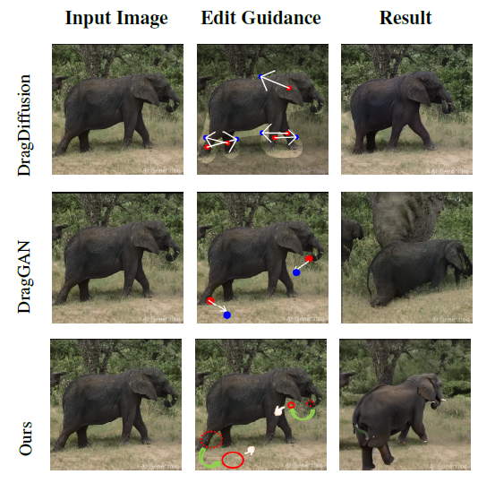
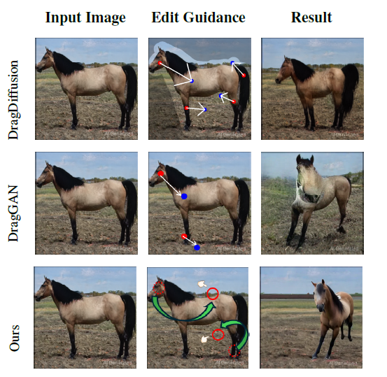

<h1 align="center">2D Instance Editing in 3D Space</h1>

<br>

<p align="center">
  
</p>

<p align="center">
  <a href="https://panaoxuan.github.io/2D-SpaceEdit-web/">
    
  </a>
  <a href="https://arxiv.org/abs/2507.05819">
    
  </a>
</p>


<p align="center">
  
  
</p>


This is the code for 2D Instance Editing in 3D Space.

2D-SpaceEdit is a novel framework for editing 2D instances in 3D space through a comprehensive pipeline. Our method first allows users to interactively select and segment target objects from input images, then reconstructs corresponding 3D models. The 3D models are represented and edited using Gaussian splatting, allowing for precise 3D manipulation. After editing, the system renders the modified objects from user-desired viewpoints and seamlessly integrates them back into the original image backgrounds. Finally, intelligent inpainting fills any remaining gaps to ensure photorealistic results. This comprehensive approach enables intuitive 2D-to-3D editing while maintaining high-quality visual consistency.

## Features

- 🎯 **Interactive Object Segmentation**: Manual target object selection and extraction
- 🎨 **Flexible Editing of 3D Gaussian Splatting**: Flexible editing of 3D Gaussian splatting representation
- 🖼️ **Novel Viewpoint Rendering**: Render edited objects from user-desired viewpoints
- 🎭 **Intelligent Inpainting**: Fill remaining gaps with context-aware inpainting
- 🛠️ **Comprehensive Pipeline**: Complete workflow from object segmentation to final output

## Project Structure

```
2D-SpaceEdit/
├── editing/                    # Core editing algorithms of 3D Gaussian
│   ├── cam_utils.py           
│   ├── edit_gui.py            
│   ├── lap_deform.py          
│   └── train_gui_utils.py     
├── inpainting/                # Inpainting pipeline
│   ├── dataset.py             
│   ├── infer_pixelhacker.py   # Remove objects and fill background
│   ├── inpainting.py          # Image restoration after placement
│   ├── pipeline.py            
│   └── placeobject.py         # Place rendered objects into background
├── preprocess/                # Data preprocessing
│   └── sam_processor.py       
├── reconstruct_from_2d/       # 2D to 3D reconstruction
│   └── app.py                 
└── requirements.txt           # Pip dependencies
└── environment.yml            # Conda dependencies
```

## Installation

### Prerequisites

- Python 3.8+
- CUDA-compatible GPU (recommended)
- Conda or virtualenv

### Setup

1. Clone the repository:
```bash
git clone --recursive https://github.com/panaoxuan/2D-SpaceEdit.git
cd 2D-SpaceEdit
```

2. Create a conda environment:
```bash
conda env create -f environment.yml
conda activate spaceedit
```

3. Install dependencies:
```bash
pip install -r requirements.txt
```

## Quick Start

### 1. Interactive Object Segmentation

Select and extract target objects from input images using SAM:

```bash
# Launch SAM interface for manual object selection
python -m preprocess.sam_processor --input /path/to/image.jpg --output_dir /path/to/outputs

# Or use short options
python -m preprocess.sam_processor -i image.jpg -o outputs
```

### 2. 3D Reconstruction

Reconstruct 3D models from segmented objects:

```bash
# Generate 3D models from 2D objects
python -m reconstruct_from_2d.app
```

### 3. Gaussian Splatting Editing & Rendering

Edit the 3D models and render from desired viewpoints:

```bash
# Launch interactive 3D editing interface
python -m editing.edit_gui --gs_path reconstruct_from_2d/gs_ply/gaussian_model.ply
```

### 4. Background Integration & Inpainting

#### 4.1 Remove Objects and Fill Background

Remove original objects from the scene and fill the holes:

```bash
# Remove objects and fill background using PixelHacker
python -m inpainting.infer_pixelhacker \
--config inpainting/config/PixelHacker_sdvae_f8d4.yaml \
--weight weight/ft_places/diffusion_pytorch_model.bin
```

#### 4.2 Place Edited Objects

Place the rendered edited objects back into the filled background:

```bash
# Place edited objects into the background
python -m inpainting.placeobject
```

#### 4.3 Final Image Restoration

Perform final inpainting to seamlessly blend the placed objects:

```bash
# Final image restoration and seamless blending
python -m inpainting.inpainting 
```

## Results

<p align="center">
  <span style="display: inline-block; width: 30%; text-align: center;"><b>original img</b></span>
  <span style="display: inline-block; width: 30%; text-align: center;"><b>edit1</b></span>
  <span style="display: inline-block; width: 30%; text-align: center;"><b>edit2</b></span>
</p>

<p align="center">
  
  
  
</p>

<p align="center">
  
  
  
</p>

<p align="center">
  
  
  
</p>

<p align="center">
  
  
  
</p>

<p align="center">
  
  
  
</p>

### Performance

Our method achieves state-of-the-art performance in:
- 2D instance editing quality
- 3D consistency preservation
- Real-time processing speed


## License

This project is licensed under the MIT License - see the [LICENSE](LICENSE) file for details.

## Citation

If you find our work useful, please consider citing:

```bibtex
@article{xie2025spaceedit,
  title={2D Instance Editing in 3D Space},
  author={Xie, Yuhuan and Pan, Aoxuan and Lin, Ming-Xian and Huang, Wei and Huang, Yi-Hua and Qi, Xiaojuan},
  journal={arXiv preprint arXiv:2507.05819},
  year={2025}
}
```

## Acknowledgements

We thank the following projects and researchers:

- [SC-GS](https://github.com/CVMI-Lab/SC-GS)
- [Segment Anything Model (SAM)](https://github.com/facebookresearch/segment-anything)

- [TRELLIS](https://microsoft.github.io/TRELLIS/)

## Support

If you encounter any issues or have questions about using 2D-SpaceEdit, please:
- Open an issue on our [GitHub repository](https://github.com/panaoxuan/2D-SpaceEdit/issues)
- Visit our project page: [https://panaoxuan.github.io/2D-SpaceEdit-web/](https://panaoxuan.github.io/2D-SpaceEdit-web/)

We appreciate your feedback and will do our best to help you resolve any problems.

---

**Note**: This code is currently being prepared for public release. Some features may be subject to change.
